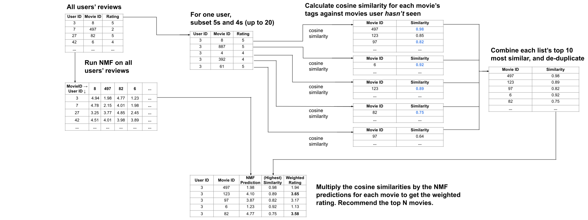

# NMF Cosine Recommender
Movie recommendation algorithm combining the collaborative filtering approach of NMF (non-negative matrix factorization) with the content filtering approach of cosine similarity.

The main dependencies are scikit-learn (for cosine similarity) and surprise (for NMF). Scikit-learn has a major flaw in its NMF implementation which is that missing values aren't handled very well. For sparse matrices (like a set of user reviews), if you initialize missing values to 0, the imputed values from NMF will be close to 0. The surprise library correctly fits to the ratings that exist.

